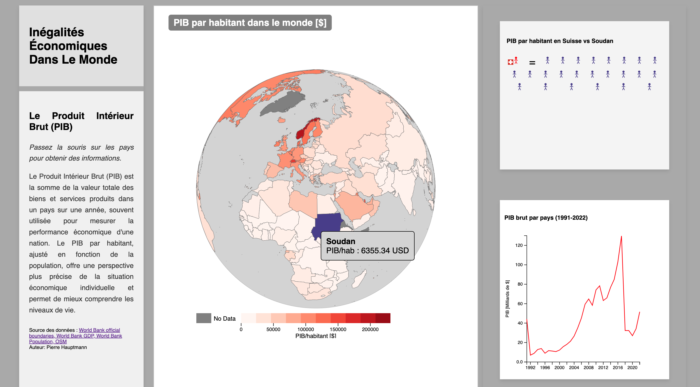

# Inégalités Économiques Dans Le Monde

## Description

Ce projet propose une visualisation des inégalités économiques mondiales en utilisant différents indicateurs économiques tels que le PIB par habitant et le PIB brut. L'objectif principal est de sensibiliser les citoyens suisses à la réalité des inégalités économiques mondiales, souvent ignorées.

### Fonctionnalités

- **Carte interactive** : Permet une vision d'ensemble et identifie de manière parlante les valeurs extrêmes tout en facilitant la comparaison avec d'autres pays.

- **Graphique des stickmen** : Représente de manière visuelle et compréhensible les richesses dans le monde à notre échelle (Suisse).

- **Graphique du PIB de 1991 à 2022** : Visualise les valeurs totales du PIB, permettant d'identifier les périodes de crise d'un pays. Avec des connaissances générales et des ressources externes, il est facile d'interpréter les variations de la courbe.

## Capture d'écran

 
 
## Installation et Lancement

1. Clonez ce dépôt sur votre machine locale :
    ```bash
    git clone https://github.com/PiHau/PIB_Monde.git
    ```
2. Accédez au répertoire du projet :
    ```bash
    cd PIB_Monde.git
    ```
3. Ouvrez le fichier `index.html` dans votre navigateur. nb: Il sera certainement nécessaire d'ouvrir un serveur local pour passer la sécurité de votre navigateur.

## Modules, Librairies et Scripts

- **D3.js** : Utilisé pour la création de graphiques dynamiques et interactifs.
- **TopoJSON** : Utilisé pour la manipulation de données géographiques.

 **les scripts (en plus de pib.js) nécessaires au bon fonctionnement de la page sont inclus dans le fichier `index.html`**


## Contexte de Développement

Ce projet a été développé dans le cadre du cours visualisation de données dispensé par Isaac Pante (SLI, Lettres, UNIL).

## Structure du Répertoire

- `index.html` : Fichier principal de la page web.
- `style/` : dossier qui contient les fichiers CSS.
- `img/` : dossier qui contient les images utilisées dans le projet.
- `scripts/` : dossier qui contient les fichiers JavaScript (`map1.js`).

## Limites et Améliorations

Veuillez consulter la section "Issues" de ce dépôt pour voir les limites actuelles du projet et les possibilités d'amélioration. Chaque issue est assortie des étiquettes adéquates (bug, enhancement, etc.).
